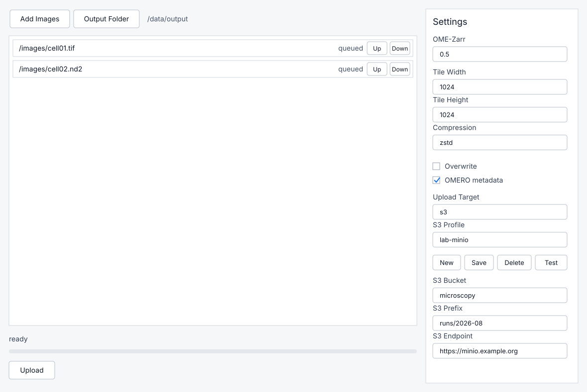

# img2omezarr

`img2omezarr` converts microscopy image files to OME-Zarr. It has both a command line user interface and a GUI aimed to make it easy
for regular users to upload their data to OME-Zarr.

**Testing needed; work in progress**

## Build

```sh
cargo build -p img2omezarr --features cli --bin img2omezarr
```

## CLI Usage

```sh
img2omezarr convert INPUT OUTPUT.ome.zarr
img2omezarr batch --output-dir OUT INPUT...
```

Run `img2omezarr --help` for the full CLI options.

## GUI S3 Profiles

The GUI can save S3 profiles between runs. Profile metadata is written to the
platform config directory, while access keys are stored in the OS credential
store through the system keyring.

Build the GUI with S3 support:

```sh
cargo run -p img2omezarr-gui --features upload-s3
```

Select `s3` as the upload target, enter a profile name, bucket, prefix, region,
endpoint, and credentials, then press `Save`.

## Screenshots



## License

This code is under MIT. But note that some libraries it depends on are GPL.
